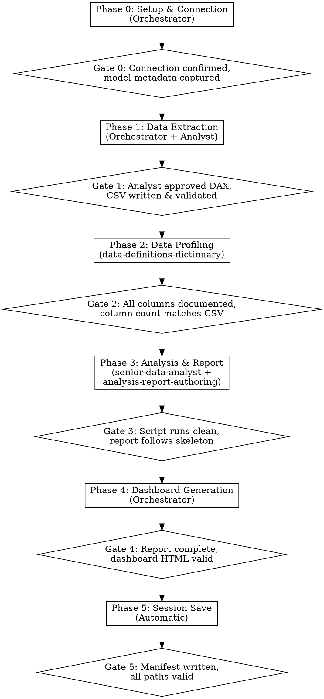

# BA Automated Analysis

Orchestrates a complete analytical workflow from Power BI semantic model to finished deliverables. Connects to a semantic model via MCP, extracts data with DAX, profiles it, runs statistical analysis in Python, and produces a markdown report plus an interactive Fluent 2 HTML dashboard. A session manifest enables one-command replay when data refreshes.

This skill orchestrates the pipeline and delegates shared work to specialist agents and skills. It owns what's unique to the Power BI path: MCP connection, DAX extraction, dashboard generation, and session replay. Profiling, analysis, and report authoring are delegated to the team's canonical specialists.

## When to Use

- You need to analyze data sourced from a Power BI semantic model via DAX
- Someone asks for "automated analysis", "ba analysis", or "analyze this model"
- You want to replay a previous analysis session from a YAML manifest
- You need a coordinated pipeline: extraction, profiling, analysis, report, and dashboard

## When NOT to Use

- Your data source is a Fabric warehouse or SQL endpoint -- this skill starts from DAX via Power BI. For SQL-based data, export a CSV first and point the AI at it directly
- You only need a single phase (e.g., just a DAX query, just a report) -- invoke the relevant reference pattern directly

## Prerequisites

1. **powerbi-modeling-mcp** MCP server configured in the analyst's environment
2. **Python 3.10+** with `pandas`, `numpy`, `scipy`, `statsmodels` installed
3. **Internet access** for Chart.js 4.x CDN (dashboard generation only)
4. **Specialist agents and skills installed:** `senior-data-analyst` agent, `data-definitions-dictionary` skill, `analysis-report-authoring` skill

## Pipeline Overview



---

## Phase 0: Setup & Connection

**Purpose:** Establish a live connection to the Power BI semantic model and capture its structure for downstream phases.

**Questions asked:**
1. "Which workspace should I connect to?" (default: `FT Data Analytics PRD`)
2. "Which semantic model should I use?"

**Actions:**
1. Connect to the workspace via `mcp__powerbi-modeling-mcp__connection_operations` (ConnectFabric)
2. Explore the model via `mcp__powerbi-modeling-mcp__model_operations` (GetModel)
3. List all tables and columns via `mcp__powerbi-modeling-mcp__table_operations` (ListTables)
4. Capture model metadata (tables, columns, measures, relationships) for use in Phase 1
5. Create the output directory structure:
   ```
   [analysis-name]/
   ├── data/
   ├── analysis/
   └── output/
   ```
   The `[analysis-name]` is derived from the analyst's data description (e.g., `win-rates-by-workload`).

**Reference files:** None -- this phase uses only MCP tool calls.

**Output:** Live MCP connection, model metadata in memory, empty directory structure created.

**Quality gate:**
- [ ] Connection to workspace confirmed (no MCP errors)
- [ ] Model metadata captured (table count > 0, column list non-empty)
- [ ] Output directory structure created

---

## Phase 1: Data Extraction

**Purpose:** Translate the analyst's natural-language data request into a DAX query, get approval, execute it, and save the results as CSV.

**Questions asked:**
1. "Describe the data you need." (natural language -- e.g., "Monthly win rates by workload family for CFY, broken down by PEC status")
2. "Does this DAX query look correct?" (present the generated query for review before executing)

**Actions:**
1. Read `references/dax-extraction.md` for DAX patterns and MCP tool call sequences
2. Write a DAX query using the model metadata from Phase 0 and patterns from the reference file
3. Present the DAX query to the analyst for review -- do NOT execute until approved
4. After approval, execute via `mcp__powerbi-modeling-mcp__dax_query_operations` (ExecuteQuery)
5. Convert results to a pandas DataFrame
6. If fiscal year data is detected (month columns, fiscal period references), add a `Month_Sort` column for correct ordering
7. Write CSV to `data/[analysis-name].csv`
8. Report the row/column shape to the analyst

**Reference files:** `references/dax-extraction.md`

**Output:** `data/[analysis-name].csv`

**Quality gate:**
- [ ] Analyst explicitly approved the DAX query before execution
- [ ] CSV file written with UTF-8 encoding
- [ ] Row count is plausible (not 0, not unexpectedly large)
- [ ] Column count matches the DAX query SELECT list
- [ ] Spot-check 5 rows for data sanity
- [ ] No unexpected NULLs in key identifier columns
- [ ] `Month_Sort` column present if fiscal year data detected

---

## Phase 2: Data Profiling

**Purpose:** Document every column and establish analysis conventions so Phase 3 has full context.

**Delegate to:** `data-definitions-dictionary` skill

**Questions asked:** None -- this phase is automatic.

**Actions:**
1. Invoke the `data-definitions-dictionary` skill, passing it:
   - The **DAX query** from Phase 1 (for the Source DAX Query section)
   - The **CSV file** from Phase 1 (for column profiling)
   - **Context:** dataset name, grain, fiscal year, population, semantic model name
2. The skill generates `data/Data Definitions.md` and `data/patterns.md` following its canonical structure (Overview, Source DAX Query, Column Dictionary, Key Business Logic, Data Quality Notes)

**Reference files:** None -- the `data-definitions-dictionary` skill carries its own domain knowledge.

**Output:** `data/Data Definitions.md`, `data/patterns.md`

**Quality gate:**
- [ ] Column count in Data Definitions.md equals column count in CSV
- [ ] Every column has: data type, source, business definition, NULL rate, example values
- [ ] Every abbreviation expanded on first use
- [ ] Derived columns have formulas documented
- [ ] Flag columns (0/1) have both values explained
- [ ] Denominator for all rate calculations is identified and documented

---

## Phase 3: Analysis & Report

**Purpose:** Generate and execute a Python analysis script, then structure the findings into a multi-audience report.

**Questions asked:**
1. "What type of analysis?" -- present the catalog:
   - **Descriptive** -- summary statistics, distributions, trends
   - **Correlation** -- Spearman correlations, chi-square tests
   - **Intervention effectiveness** -- NNT, CMH odds ratios, lift tables
   - **Dimensional breakdown** -- win rates, representation ratios by dimension
   - **Feature importance** -- information gain, predictive ranking
   - **Growth & adoption** -- usage rates, distribution analysis, trend decomposition
2. "Who is the audience?" -- `leadership-brief`, `technical-report`, or `both`

**Actions:**
1. **Delegate analysis to `senior-data-analyst` agent:**
   - Pass it the CSV, `data/Data Definitions.md`, and `data/patterns.md` for context
   - The agent generates `analysis/run_analysis.py` with standard imports, helper functions, and analysis-specific code
   - Execute via Bash: `python analysis/run_analysis.py`
   - Review console output for errors or anomalous results
2. **Delegate report authoring to `analysis-report-authoring` skill:**
   - Pass it the analysis output from step 1
   - The skill structures findings into the fixed report skeleton (How to Read, Executive Summary, Population, Analysis Sections, Methodology)
   - Output saved to `output/[Analysis Name] Report.md`

**Reference files:** None -- delegates carry their own domain knowledge.

**Output:** `analysis/run_analysis.py`, `output/[Analysis Name] Report.md`

**Quality gate:**
- [ ] Script executes without errors
- [ ] Every statistical test includes effect size (no naked p-values)
- [ ] Wilson CIs on every proportion
- [ ] Causation caveats on all intervention analyses
- [ ] Denominators stated for every rate
- [ ] Report follows fixed skeleton with "How to Read This Report" section
- [ ] Surprising results investigated, not just reported

---

## Phase 4: Output Generation

**Purpose:** Generate a Fluent 2 HTML dashboard from the analysis results. The markdown report is already generated by `run_analysis.py` in Phase 3 -- this phase does NOT regenerate it.

**Questions asked:** None -- uses the audience selection from Phase 3.

**Actions:**
1. Read the report markdown from `output/[Analysis Name] Report.md` (produced by Phase 3)
2. Read `references/fluent2-tokens.md` for Fluent 2 design tokens, Chart.js palette, and layout rules
3. Generate a self-contained HTML dashboard dynamically -- adapt chart count, layout, and content to the actual analysis (do not use a fixed template):
   - Header with analysis title, snapshot date, and model name
   - 3-4 KPI cards with headline metrics from the analysis results
   - Chart.js 4.x charts (number and type driven by the data, not a fixed 2-chart grid)
   - Sortable data table with right-aligned numerics and bold primary metric column
   - 3-5 key insights with statistical evidence
   - Methodology footer with tests used and caveats
4. Write the HTML to `output/[Analysis Name] Dashboard.html`
5. Verify the HTML is well-formed (matching tags, valid Chart.js config)

**Reference files:** `references/fluent2-tokens.md`

**Output:** `output/[Analysis Name] Dashboard.html`

**Quality gate:**
- [ ] Dashboard HTML renders without errors
- [ ] KPI cards reflect the report's headline findings
- [ ] Chart.js configs are valid and chart types match the data
- [ ] Data table columns match the analysis dimensions
- [ ] Insights section has 3-5 bullet findings with evidence
- [ ] Methodology footer matches the report's methodology section
- [ ] Responsive layout: multi-column at 768px+, single column below

---

## Phase 5: Session Save

**Purpose:** Persist the analysis recipe as a YAML manifest so the entire workflow can be replayed with one command when data refreshes.

**Questions asked:** None -- this phase is automatic.

**Actions:**
1. Write `session-manifest.yaml` to the analysis root directory with this structure:
   ```yaml
   version: 1
   created: <ISO timestamp>
   updated: <ISO timestamp>
   skill: ba-automated-analysis
   connection:
     workspace: "<workspace name>"
     semantic_model: "<model name>"
   extraction:
     description: "<analyst's natural-language request>"
     dax_query: |
       <the exact DAX query executed>
     row_count: <N>
     column_count: <N>
   analysis:
     type: "<descriptive | correlation | intervention-effectiveness | dimensional-breakdown | feature-importance | growth-adoption>"
     audience: "<leadership-brief | technical-report | both>"
     parameters: { <analysis-type-specific key-value pairs> }
   outputs:
     csv: "data/<name>.csv"
     data_definitions: "data/Data Definitions.md"
     patterns: "data/patterns.md"
     analysis_script: "analysis/run_analysis.py"
     report_markdown: "output/<Analysis Name> Report.md"
     dashboard_html: "output/<Analysis Name> Dashboard.html"
   ```
2. Summarize all created files with descriptions
3. Explain replay: "To refresh this analysis with current data, invoke this skill and point to `session-manifest.yaml`."

**Reference files:** None -- the manifest schema is defined above.

**Output:** `session-manifest.yaml`

**Quality gate:**
- [ ] Manifest written with all required fields populated
- [ ] All file paths in the `outputs` section point to files that exist
- [ ] DAX query in manifest matches the query that was executed
- [ ] Row count and column count match the actual CSV

---

## Replay Mode

When an analyst invokes this skill with an existing manifest, the workflow switches to replay mode instead of running the full interactive pipeline.

**How to invoke:** "Run ba-automated-analysis with manifest at `./session-manifest.yaml`"

**Actions:**
1. Read `session-manifest.yaml` and validate all required fields
2. Reconnect to the same workspace and semantic model (Phase 0, non-interactive)
3. Re-execute the stored DAX query (Phase 1, non-interactive)
4. Report data delta: **"Previous: X rows. Current: Y rows (+Z new records)"**
5. Re-run data profiling (Phase 2)
6. Re-run the same analysis type with the same parameters (Phase 3)
7. Regenerate all outputs -- report and dashboard (Phase 4)
8. Update the manifest with new `updated` timestamp and `row_count` (Phase 5)

**Key difference from first run:** No interactive questions are asked. All parameters come from the manifest. The analyst only needs to review the data delta and the refreshed outputs.

---

## Complete Deliverable Package

At pipeline completion, the analysis folder contains:

```
[analysis-name]/
├── data/
│   ├── [name].csv                          -- Phase 1: Extracted data
│   ├── Data Definitions.md                 -- Phase 2: Column dictionary
│   └── patterns.md                         -- Phase 2: Analysis conventions
├── analysis/
│   └── run_analysis.py                     -- Phase 3: Statistical analysis script
├── output/
│   ├── [Analysis Name] Report.md           -- Phase 3: Analytical report (markdown)
│   └── [Analysis Name] Dashboard.html      -- Phase 4: Interactive dashboard (HTML)
└── session-manifest.yaml                   -- Phase 5: Replay manifest
```

---

## Error Handling

| # | Failure Scenario | Cause | Recovery Action |
|---|------------------|-------|-----------------|
| 1 | MCP connection failure | Workspace name misspelled, MCP server not configured, or Power BI service unavailable | Verify workspace name spelling. Check that `powerbi-modeling-mcp` is configured in the environment. Retry after confirming the Power BI service is accessible. |
| 2 | Empty DAX results (0 rows) | DAX query filters too restrictive, table name mismatch, or model not refreshed | Review the DAX query filters against the model metadata. Check table/column names for typos. Confirm the model has been refreshed recently. Widen filters and retry. |
| 3 | Column count mismatch in profiling | CSV export dropped columns, or DAX query returns computed columns not in the original SELECT | Reconcile the CSV headers against the DAX query output. If columns were dropped during DataFrame conversion, fix the conversion logic. Do NOT document phantom columns. |
| 4 | Python analysis script error | Missing package, incompatible data types, division by zero on empty groups | Read the full traceback. Check that all required packages are installed (`pip install pandas numpy scipy statsmodels`). Add guard clauses for empty groups or NaN values. Fix and re-execute -- do not skip the analysis. |
| 5 | Chart.js CDN unavailable | No internet access, CDN outage, or corporate proxy blocking | The dashboard will render without charts but KPI cards and tables remain functional. If persistent, download Chart.js locally and update the script tag `src` to a local path. |
| 6 | Manifest file corrupted on replay | Manual edits introduced YAML syntax errors, or file encoding changed | Validate YAML syntax before parsing. If the manifest is unrecoverable, re-run the full interactive workflow to generate a fresh manifest. Do not attempt partial repairs on a corrupted manifest. |

---

## Progressive Disclosure

- **SKILL.md** is always loaded when the skill is invoked -- it contains the full orchestration flow, quality gates, and error handling
- **Reference files** are read on-demand during the relevant phase:
  - `references/dax-extraction.md` -- loaded in Phase 1 only
  - `references/fluent2-tokens.md` -- loaded in Phase 4 only
- **Delegated phases** load their own domain knowledge:
  - Phase 2: `data-definitions-dictionary` skill
  - Phase 3: `senior-data-analyst` agent + `analysis-report-authoring` skill
- This architecture keeps the initial context load small, eliminates duplication, and ensures each domain has a single canonical source of truth
